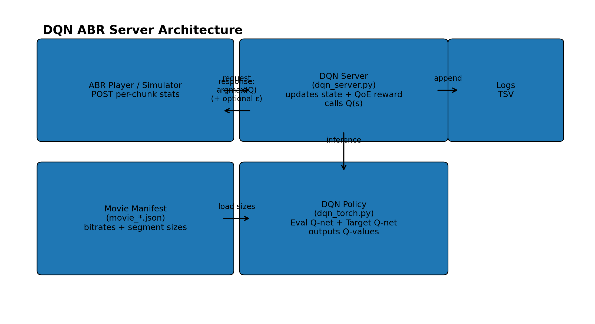

## DQN ABR Server

A lightweight **HTTP ABR decision server** using a **Pensieve-style RL state** and a **DQN / Double-DQN** value-based policy.

### Quickstart

#### Install Requirements

```bash
pip install numpy torch
```

#### Run the server

```bash
python dqn_server.py --host localhost --port 8606 --movie ../movie_4g.json --model server/models_dqn/dqn_ep_400.pth --debug --verbose
```

- If the model file is missing, the server continues with randomly initialized weights.
- Logs are written under `../SERVER_LOGS` by default.
- Optional: enable exploration at inference time with `--epsilon 0.05` (default is greedy).

---

### Architecture

- **Client(Video Player)** sends per-chunk playback & download stats
- **Server** updates the RL state, computes a QoE reward (for analysis), and returns the **next quality index**
- **DQN policy** returns **Q-values**; server selects `argmax(Q)` (optionally ε-greedy)
- **Logs** are written for plotting




---

### Deep Q-Network (DQN) 

 DQN is model-free RL algorithm that combines Q-learning with deep neural networks. DQN learns a **state-action value function**:

- **State**: recent history of buffer, throughput, download time, next chunk sizes, etc.
- **Action**: discrete quality index (e.g., 0..5)
- **Q-value**: expected discounted return if you choose action `a` in state `s`

At inference:
- compute `Q(s, ·)`
- choose `argmax_a Q(s, a)` as the next quality (or explore with ε)


### State space

- `S_INFO = 6`, `S_LEN = 8` → state is represented as `6 × 8`

On each chunk, the newest “column” of the state includes:

- last selected bitrate (normalized)
- buffer level (normalized)
- throughput estimate from last download
- download time (normalized)
- **next chunk sizes** for all qualities
- remaining chunks (normalized)

### Action space

- `A_DIM = 6` → 6 discrete quality levels


### Reward function (QoE)

The server logs a per-chunk QoE reward (DQN inference does **not** use reward online; reward is for analysis and for training in `train_dqn.py`).

Objective:
- Higher bitrate implies higher reward
- Stalls are heavily penalized
- Large jumps in quality are penalized (smoothness)

$$R = \frac{b}{1000}- 20.0 \cdot \Delta t_{stall}- 1.0 \cdot \frac{|b - b_{prev}|}{1000}$$

Where:
- $b$ is the selected chunk bitrate in kbps
- $\Delta t_{stall}$ is the **incremental** rebuffer time (seconds) since the previous decision
- $b_{prev}$ is the previous selected bitrate (kbps)

Plain text:
```text
Reward = bitrate_mbps - 20.0 * stall_seconds - 1.0 * abs(bitrate_mbps - last_bitrate_mbps)
```

---

## Training

This repo includes a DQN training driver (`train_dqn.py`) that learns Q-values using:

- **Experience replay** buffer: `(s, a, r, s', done)`
- **Double-DQN target**: next action from eval-net, next value from target-net
- **Target network** with soft updates: `τ = 1e-5`


### Training loop

1) Reset env → get initial state `s`
2) Choose action with ε-greedy:
   - with prob ε: random action
   - else: `a = argmax(Q_eval(s))`
3) Step env → get `(s', r, done)`
4) Push transition into replay buffer
5) Once replay buffer is warm (`min_replay`), sample a minibatch and train:
   - **Eval**: `Q_eval(s,a)`
   - **Target**: `y = r + γ(1-done)*Q_target(s', argmax(Q_eval(s')))`
6) Soft-update target net toward eval net (Polyak averaging)

### Configure training inputs

Inside `train_dqn.py`, set paths:

- `TRACE_JSON_PATH` → `network.json` (bandwidth/latency trace)
- `VIDEO_PATH` → `movie_4g.json` (segment sizes/bitrates manifest)
- `SAVE_DIR` → where checkpoints are written (default: `server/models_dqn`)

### Run training

```bash
python train_dqn.py
```

Checkpoints are saved every 100 episodes:

```text
server/models_dqn/dqn_ep_100.pth
server/models_dqn/dqn_ep_200.pth
...
```

### Use a trained model in the server

```bash
python dqn_server.py --host localhost --port 8606 --movie movie_4g.json --model server/models_dqn/dqn_ep_400.pth --debug --verbose
```

---

## SHIM/HTTP API

#### HTTP Request

Sent by the video player:
- `lastquality` (int)
- `lastRequest` (int) chunk index
- `buffer` (float) seconds
- `RebufferTime` (float) cumulative ms
- `lastChunkStartTime` / `lastChunkFinishTime` (ms timestamps)
- `lastChunkSize` (bytes)

#### HTTP Response

Returns 0 to 5 for next quality index, Return `"REFRESH"` at end-of-video


#### Movie manifest format (`movie_*.json`)

The server expects:
- `segment_duration_ms`
- `bitrates_kbps` (length == `A_DIM`)
- `segment_sizes_bits`: list of segments, each contains sizes in **bits** for each quality


#### Logging

Each chunk produces a TSV line like:

```text
time  bitrate_kbps  buffer_s  rebuf_delta_s  chunk_size_bytes  fetch_time_ms  reward
```

Use these logs to plot:
- bitrate over time
- buffer level and stalls
- reward distribution / CDF
- (optional) Q-values vs time if you print them with `--verbose`
