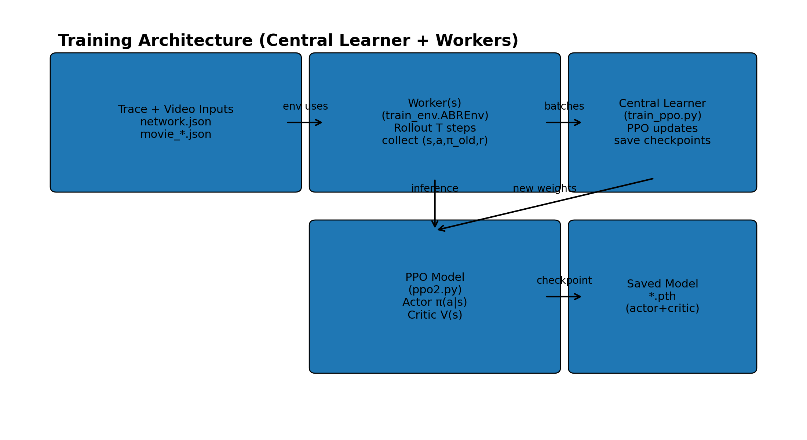

## PPO (Pensieve-style)

A lightweight **HTTP ABR decision server** using a **Pensieve-style RL state** and a **PPO actor-critic** policy.


### Quickstart

#### Install Requirements

```bash
pip install numpy torch
```

#### Run the server

```bash
python ppo_server.py --host localhost --port 8605 --movie ../movie_4g.json --model models/ppo_model.pth --debug --verbose
```

- If the model file is missing, the server continues with randomly initialized weights.
- Logs are written under `../SERVER_LOGS` by default.


### Architecture

- **Client(Video Player)** sends per-chunk playback & download stats
- **Server** updates the RL state, computes a QoE reward, and returns the **next quality index**
- **Logs** are written for plotting


---

#### How it works 

ABR picks the next chunk quality to maximize QoE by leveraging  **PPO** (policy gradient) to learn the mapping from state → action.:

- **State**: recent history of buffer, throughput, download time, next chunk sizes, etc.
- **Action**: discrete quality index (e.g., 0..5)
- **Reward**: quality reward − rebuffer penalty − smoothness penalty


#### State space

- `S_INFO = 6`, `S_LEN = 8` → state is represented as `6 × 8` dimension


On each chunk, the newest “column” of the state includes:

- last selected bitrate (normalized)
- buffer level (normalized)
- throughput estimate from last download
- download time (normalized)
- **next chunk sizes** for all qualities
- remaining chunks (normalized)

#### Action space 
- `A_DIM = 6` → 6 discrete quality levels


#### Reward function

The server computes a **per-chunk QoE reward** with this objective: 
- Higher bitrate implies higher reward
- Stalls are heavily penalized
- Large jumps in quality are penalized (smoothness)

$$R = \frac{b}{1000}- 4.3 \cdot \Delta t_{stall}- 1.0 \cdot \frac{|b - b_{prev}|}{1000}$$


Where:
- $b$ is the selected chunk bitrate in kbps
- $\Delta t_{stall}$ is the **incremental** rebuffer time (seconds) since the previous decision
- $b_{prev}$ is the previous selected bitrate (kbps)

This equation is represented as:
```text
Reward = bitrate_mbps - 4.3 * stall_seconds - 1.0 * abs(bitrate_mbps - last_bitrate_mbps)
```


---

## Training

This repo includes a PPO training driver (`train_ppo.py`) that learns an ABR policy using the same **Pensieve-style state** and the same **QoE reward** objective used by the server.



### Training architecture

- **Central learner** (main process) owns the PPO model (`ppo2.Network`)
  - collects batches from workers
  - runs PPO updates (actor + critic)
  - periodically saves checkpoints (`*.pth`)
- **Worker(s)** run the ABR environment (`train_env.ABREnv`)
  - roll out trajectories for `TRAIN_SEQ_LEN` steps
  - send `(state, action, old_prob, reward)` batches back to the learner

### What gets trained

PPO optimizes:
- **Actor**: action distribution `π(a|s)` over quality indices (0..5)
- **Critic**: value `V(s)` for advantage estimation / bootstrapped returns

A typical rollout batch contains:
- `s_batch`: states `[T, 6, 8]`
- `a_batch`: one-hot actions `[T, 6]`
- `p_batch`: old policy probs `[T, 6]` (needed for PPO ratio)
- `v_batch`: bootstrapped returns `[T, 1]`

### Bootstrapped returns

Training uses discounted returns (with optional bootstrap from the critic value at the last state):

```text
R[t] = r[t] + GAMMA * R[t+1]
```

### Configure training inputs

Inside `train_ppo.py`, make sure these paths exist and point to the right files:

- `TRACE_JSON_PATH` → `network.json` (bandwidth/latency trace)
- `VIDEO_PATH` → `movie_4g.json` (segment sizes/bitrates manifest)
- `SUMMARY_DIR` → where checkpoints/logs are written
- `NN_MODEL` → optional pretrained model to resume from (if present)

### Run training

```bash
python train_ppo.py
```

You should see epoch progress logs and periodic checkpoints written into `SUMMARY_DIR`, e.g.:

```text
server/models/nn_model_ep_300.pth
```

### Use a trained model in the server

Once you have a checkpoint, start the decision server with it:

```bash
python ppo_server.py --host localhost --port 8605 --movie movie_4g.json --model server/models/nn_model_ep_300.pth --debug --verbose
```

Notes:
- The server expects checkpoints containing **both** actor and critic weights (saved together by PPO).
- If you want deterministic evaluation, you can modify the server to pick `argmax(π(a|s))` instead of sampling.

---
### Pensieve-PPO vs Original Pensieve A3C

#### Training update rule

- PPO trains by computing the probability ratio π_new/π_old and uses a clipped objective (trust-region-like) to prevent overly large policy updates. 
- A3C has workers compute gradients locally (compute_gradients) and the central learner averages them and applies them directly and no explicit “how far can the policy move” constraint.

- PPO can reuse a rollout batch for multiple passes (epochs/minibatches), improving sample efficiency. A3C uses each rollout essentially once, then moves on.

- **Parallelism**: PPO is usually run with synchronized batches (central learner + workers) → more stable gradients.
- A3C relies on multi-agent gradient noise and frequent synchronization; this can be sensitive to learning rates and worker timing. 

- **Checkpoint**: PPO commonly stores actor+critic together. A3C training saves separate actor + critic checkpoints (a3c_actor_ep_*.pth, a3c_critic_ep_*.pth) but its often actor-only deployment thus we are left with extra bookkeeping for critic files.


#### Why PPO is better

**Stability**
PPO’s clipping prevents “policy jumps” when reward/advantages are spiky. A3C can be more prone to instability because it applies raw policy-gradient updates without a clip/trust region.

**Better sample efficiency**
PPO typically extracts more learning signal per rollout because it can do multiple optimization epochs per batch; A3C generally discards rollouts after one gradient step. 

**Easier tuning and scaling**
PPO is typically less sensitive to worker timing / gradient variance . A3C requires more careful tuning of LR/entropy weight/worker sync to avoid noisy or stale gradients harming convergence.


---
### SHIM/HTTP API

#### HTTP Request

Sent by the video player:
- `lastquality` (int)
- `lastRequest` (int) chunk index
- `buffer` (float) seconds
- `RebufferTime` (float) cumulative ms
- `lastChunkStartTime` / `lastChunkFinishTime` (ms timestamps)
- `lastChunkSize` (bytes)

#### HTTP Response

Returns 0 to 5 for next quality index, Return `"REFRESH"` at end-of-video

#### Movie manifest format (`movie_*.json`)

The server expects:
- `segment_duration_ms`
- `bitrates_kbps` (length == `A_DIM`)
- `segment_sizes_bits`: list of segments, each contains sizes in **bits** for each quality


#### Logging

Each chunk produces a TSV line like:

```text
time  bitrate_kbps  buffer_s  rebuf_delta_s  chunk_size_bytes  fetch_time_ms  entropy  reward
```

Use these logs to plot:
- bitrate over time
- buffer level and stalls
- reward distribution / CDF
- entropy (policy confidence)
---
