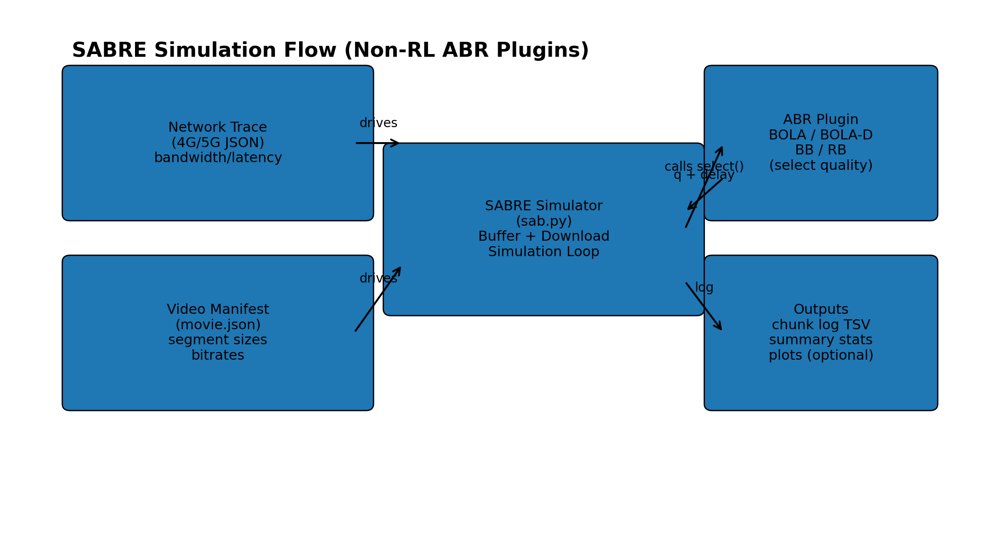

### ABR Algorithms (BOLA, Dynamic, BB, RB) + SABRE Simulator

 **classic non‑RL ABR algorithms** implemented as **SABRE plugins**:

- **BOLA** (Buffer Occupancy based Lyapunov Algorithm) — `bola.py`
- **BOLA‑D / Dynamic** (switches BOLA ↔ Throughput rule) — `bola-d.py`
- **BB** (Buffer‑Based ABR / BBA‑like) — `bb.py`
- **RB** (Rate‑Based ABR, throughput‑only) — `rb.py`

These are **rule‑based** policies (no neural networks). They are ideal baselines to compare against RL policies like PPO/A3C/DQN.

---

## What is SABRE?

**SABRE** is a playback + network simulator for ABR research. It provides:

- A simulated **player buffer** and **chunk download** pipeline
- Hooks for ABR algorithms via a simple plugin API (`select(ctx, seg_idx) -> AbrDecision`)
- Standard outputs: per‑chunk logs (bitrate, buffer, stall, bandwidth, reward/QoE) for plotting/comparison

You run SABRE with:
- a **network trace** (e.g., 4G/5G bandwidth + latency patterns)
- a **movie manifest** (segment duration + size per quality)
- an **ABR plugin** (BOLA/BB/RB/etc.)



---

## Quickstart: run SABRE with a plugin

Example command from the BB plugin header:

```bash
python sab.py --plugin bb.py -a bb -n 4Glogs_lum\4g_trace_driving_50015_dr.json -m movie.json --chunk-log-start-ts 1608418123 --chunk-log log_BB_driving_4g -v
```
(From `bb.py`)

General pattern:

```bash
python sab.py   --plugin <plugin_file.py>   -a <abr_name>   -n <trace.json>   -m <movie.json>   --chunk-log <output_prefix>   -v
```

Where:
- `--plugin` points to the plugin implementation (e.g., `bola.py`)
- `-a` selects the registered ABR name (`bola`, `dynamic`, `bb`, `rb`)
- `-n` is your network trace
- `-m` is your movie manifest
- `--chunk-log` writes a chunk‑level TSV log
- `-v` enables verbose output

---

## SABRE plugin interface 

Each ABR plugin is a class registered via `@register_abr("<name>")` and implements at minimum:

- `first_quality(ctx) -> int` (initial quality)
- `select(ctx, seg_idx) -> AbrDecision(quality, delay_s)`

SABRE provides a `ctx` (context) that includes:
- `ctx.manifest.bitrates_kbps`
- `ctx.buffer.level_ms()` (buffer occupancy in ms)
- `ctx.max_buffer_ms`
- `ctx.throughput_est` and `ctx.latency_est` (if available)

All of your plugins follow this pattern. fileciteturn5file0turn5file1turn5file2turn5file3

---

# Algorithms

## 1) Rate‑Based (RB) 

**Idea:** choose the highest bitrate that is ≤ the current throughput estimate.

Implementation (`rb.py`):

- If throughput is unknown → choose quality 0
- Else increment quality while `bitrates[q+1] <= throughput`

Pros:
- Simple and responsive to bandwidth changes

Cons:
- Can cause **rebuffering** if throughput is noisy or the estimate is optimistic
- Ignores buffer level entirely (no “safety cushion”)

When to use:
- As a baseline, or when buffer is large and throughput estimator is robust

---

## 2) Buffer‑Based (BBA)

**Idea:** choose bitrate based on buffer occupancy.

Your implementation (`bb.py`) follows a standard BBA mapping:

- If `buffer <= reservoir` → choose **lowest** quality
- If `buffer >= reservoir + cushion` → choose **highest** quality
- Else → **linearly map** buffer to a quality index 

In code:
- `reservoir_ms = 5000`
- `cushion_ms = 6500` (hardcoded here) 

### Optional safety cap (throughput guardrail)

BB includes an optional “safety cap”:

- `SAFETY_CAP = 0.85` by default
- cap quality so that selected bitrate does not exceed `0.85 * throughput_est` 

This prevents “crazy overshoots” when buffer is high but bandwidth is not.

Pros:
- Very stable (buffer‑aware), avoids stalls when buffer is low
- Great for smoothing out noisy throughput estimates

Cons:
- Can be slow to ramp up quality if reservoir/cushion are conservative
- Needs reasonable reservoir/cushion tuning per content/segment duration

---

## 3) BOLA (Buffer Occupancy based Lyapunov Algorithm)

**Core idea:** optimize a **utility‑per‑bit** score that balances:
- higher video utility (quality)
- buffer occupancy (avoid stalls)
- bitrate cost (download size)

Your code computes a utility per quality:

- utilities are log‑bitrate based: `u(q) = log(bitrate_q) + u0`
- `u0` shifts the utility baseline (two modes: “zero” and “one”)  

BOLA uses a tunable **gp** (gain parameter) and computes `Vp`:

```text
Vp = (buffer_size_ms - segment_time_ms) / (u_max + gp)
```
(see `BolaBase.__init__`)  

### BOLA scoring rule

For each quality `q`, compute:

```text
score(q) = (Vp * (u(q) + gp) - buffer_level_ms) / bitrate_kbps[q]
```
(see `score_quality`)  

Pick the `q` with the maximum score.  

### Anti‑oscillation & safe upgrade logic

Your `Bola.select()` includes practical safeguards:

- it checks throughput feasibility before increasing quality (via `quality_from_throughput`)  
- it can introduce **delay** (sleep) to keep buffer near a target max level for a quality:
  - `delay = max(0, buffer_level - max_level_for(q))`  
- optional “basic” mode disables some adaptivity (`abr_basic`)
- `abr_osc` controls whether to use the delay‑based oscillation control path  

#### Chunk abandonment (and replace)

BOLA can optionally decide to **abandon** the in‑progress chunk and restart at a lower quality when it becomes suboptimal.  
Your code compares the “score” of staying vs switching and returns a lower `q` when beneficial.  

Pros:
- Strong theoretical grounding + good stability
- Buffer‑aware, avoids stalls, controls oscillation

Cons:
- Needs parameters (`gp`, buffer size assumptions) aligned with playback constraints
- More complex than BB/RB


 **BOLA paper**:
**“BOLA: Near-Optimal Bitrate Adaptation for Online Videos” (Spiteri, Urgaonkar, Sitaraman, 2020)**  models video as fixed-duration segments (`p` seconds each) encoded at `M` bitrate levels; level `m` has size `S_m` bits and utility `υ_m` with monotonic ordering (`υ_1 ≤ … ≤ υ_M` ⇔ `S_1 ≤ … ≤ S_M`).  

The player maintains a buffer (in segments) up to `Q_max`, and aims to maximize time-average utility while avoiding rebuffering—*without bandwidth prediction*.

### The core BOLA decision rule

At each decision point (slot), given buffer level `Q(t_k)`, BOLA chooses either:
- **no-download**, or
- download next segment at bitrate index `m*` maximizing the ratio:

```text
(V * υ_m + V * γ * p - Q(t_k)) / S_m
```

among indices where the numerator is positive.

**Key intuition:**
- Larger buffer `Q` pushes the score down, favoring *not downloading* or a *higher bitrate only when safe*.
- No bandwidth estimate required—the decision depends on buffer level only.

### Choosing right V (control knob)

The paper shows a classic Lyapunov tradeoff: with an appropriate `V`, BOLA achieves time-average utility within `O(1/V)` of optimal, while keeping backlog `O(V)`.

Theorem 1(in paper) provides a **safe range** for `V` tied to buffer size:

```text
0 < V ≤ (Q_max - 1) / (υ_M + γp)
```

and guarantees the buffer never exceeds `Q_max`.


### Implementations

 `bola.py` (and `bola-d.py`) implementations mirror these ideas:

- **Utility model**: log-bitrate utilities and a `u0` offset matches the paper’s suggestion of concave utility (e.g., log) and tunable parameters (γ, V).
- **Score-based selection**: `score_quality()` implements the core ratio form (utility+γ term minus buffer, divided by bitrate/size), consistent with Eq. 10/11.
- **Abandonment**:  Dynamic / ThroughputRule has abandonment logic; BOLA-FINITE in the paper proposes abandonment using remaining size `S_Rm`.
- **Dynamic hybrid**: the paper mentions a “DYNAMIC” hybrid (throughput at startup, BOLA afterwards). Your `bola-d.py` implements a hybrid policy that switches between BOLA and a throughput rule based on buffer thresholds.


---

### BOLA‑D / Dynamic

Your `Dynamic` policy (`bola-d.py`) combines:
- **BOLA** (buffer‑optimal)
- **ThroughputRule** (rate‑based with safety factors + latency‑aware IBR) 

#### Throughput Rule

- Selects `q = quality_from_throughput(tput * safety_factor)` with `safety_factor = 0.9` 
- Adds **latency‑aware IBR** (if latency estimate is available):
  - computes a `safe_bits` budget based on `(buffer_level - latency) * throughput` and an adaptive safety multiplier 
- Supports **abandonment** if the remaining download time is likely to exceed an `abandon_multiplier * segment_time` 

### Dynamic switching rule

`Dynamic` flips between BOLA and ThroughputRule based on buffer level:

- threshold: `low_buffer_threshold_ms = 10_000`
- if currently using BOLA and buffer drops below threshold and BOLA’s quality < throughput’s quality → switch to throughput
- else if using throughput and buffer is above threshold and BOLA quality ≥ throughput quality → switch to BOLA 

Pros:
- Combines BOLA’s stability with throughput responsiveness
- Tends to avoid low‑buffer traps while still ramping quality efficiently

Cons:
- More parameters and more moving parts (safety factors, thresholds, abandon rules)
- Switching logic can be sensitive if buffer estimates are noisy

---

## when to use what

- **RB**: fastest to react, easiest baseline; can stall if estimator is optimistic.
- **BB**: very robust vs stalls; slower ramp‑up; tuning reservoir/cushion matters.
- **BOLA**: theory + strong stability; handles oscillation & can delay/abandon; needs gp/buffer assumptions.
- **BOLA‑D**: best “hybrid” heuristic; often strong in practice; more complex/tunable.

---

## Plots (from SABRE logs)


- bitrate over time
- buffer level over time
- stall time distribution (or stall events)
- QoE / reward CDF (which algorithm “wins” most often)
- startup delay distribution (if logged)
- switch frequency (number of quality changes)

---


## RL ABR (Remote/ HTTP SHIM)

SABRE can also run **RL ABR algorithms** (PPO / A3C / DQN) through a lightweight **remote HTTP “SHIM”** plugin.  This keeps SABRE’s simulator loop unchanged while moving the ABR decision logic into an external server process.


## When to use the SHIM

Use the SHIM when:
- your ABR logic runs as a **separate HTTP server** (e.g., `ppo_server.py`, `pensieve_server.py`, `dqn_server.py`)
- you want SABRE to act as the **client/simulator** and request an action (quality index) per segment
- you want an “apples-to-apples” comparison between non‑RL plugins and RL agents under the same traces/manifests

## How the SHIM works (`shim_base.py`)

`shim_base.py` implements `HttpShimBase`, a SABRE ABR plugin that:

### 1) Tracks the completed download and builds a POST payload
On each completed segment download, SABRE calls:

- `on_download(ctx, dp, is_replacement)`

The SHIM uses:
- `dp.index`, `dp.quality`, `dp.time_ms`, `dp.size_bits`, `dp.time_to_first_bit_ms`
- `ctx.buffer.level_ms()` (buffer occupancy)
- `ctx.buffer.stats.rebuffer_time_ms` (cumulative rebuffer time)
- `ctx.manifest.segments_bits` (fallback if `dp.size_bits` is missing)

It then prepares a **Pensieve-style** JSON payload (one payload per completed segment):

```json
{
  "lastquality": <int>,
  "RebufferTime": <cumulative_ms>,
  "buffer": <seconds>,
  "lastChunkStartTime": <ms>,
  "lastChunkFinishTime": <ms>,
  "lastChunkSize": <bytes>,
  "lastRequest": <segment_index>
}
```

Implementation details:
- The SHIM maintains a **synthetic clock** (`_synthetic_clock_ms`) and sets:
  - `lastChunkStartTime = previous_clock`
  - `lastChunkFinishTime = previous_clock + dp.time_ms`
- `lastChunkSize` is converted from bits → bytes.
- Replacements/abandoned partial downloads are **skipped** so you do not train/decide on partial segments.

### 2) Calls the remote ABR server (HTTP POST) and returns the next quality
On SABRE’s next decision point, it calls:

- `select(ctx, seg_idx) -> AbrDecision(quality, delay_s)`

The SHIM POSTs the prepared payload to:

- `DEFAULT_SHIM_URL = "http://127.0.0.1:8333/"` (override via config)

The server is expected to return:
- a quality index as a string (e.g., `"0".."5"`), or
- `"REFRESH"` at end-of-video (the SHIM resets and returns 0).

### 3) Built-in fallback if the server is down
If the POST fails or times out, the SHIM falls back to a local **rate-based** choice:

- choose the highest bitrate `<= ctx.throughput_est`

This makes your simulation robust even if the RL server isn’t running.

### 4) Debug/ping knobs
The SHIM supports:
- `timeout_s` (default `1.0`)
- `debug_p` (prints payload + HTTP events)
- `ping_on_start` (default `True`, does a quick HTTP check in `first_quality()`)

## Typical workflow

1) Start the RL server (example PPO):
```bash
python ppo_server.py --host 127.0.0.1 --port 8333 --movie movie.json --model models/ppo_model.pth --debug --verbose
```

2) Run SABRE using the SHIM plugin (registration/wrapper name may vary by repo):
```bash
python sab.py --plugin shim_base.py -a mpc -n trace.json -m movie.json --chunk-log log_PPO_remote -v
```

Notes:
- The SHIM sends one POST per segment, using the segment that just finished to decide the next one.
- If you see warnings about `lastRequest`, it usually means there was a skipped download (replacement/abandonment) or a mismatch in segment indexing.

## To-Do

- Show algo/equations/definitions for BOLA 
- and cite specific paper sections/figures here 

---

