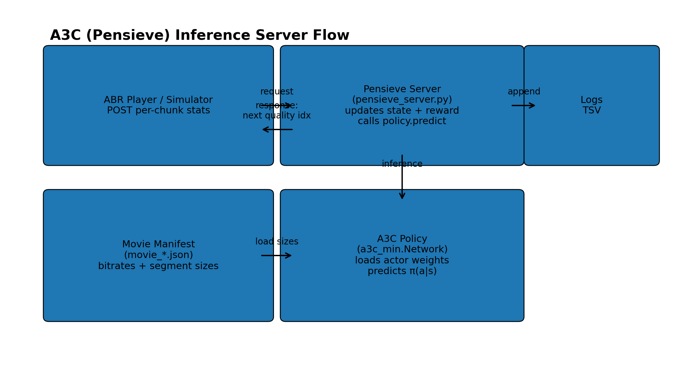
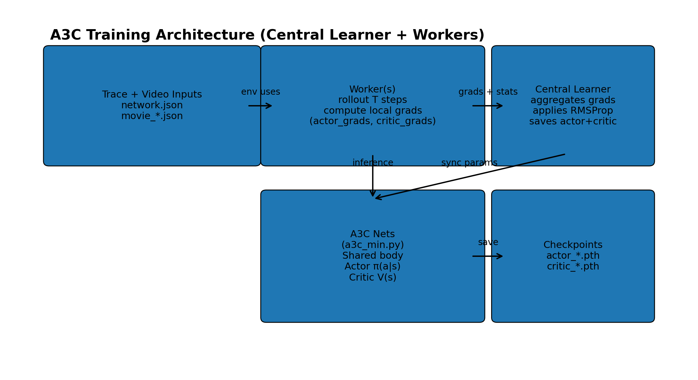

## Pensieve A3C ABR Server

implementing the **classic Pensieve** approach: an **A3C actor-critic** policy that selects the next video chunk quality from a **Pensieve-style state**.

- **Client (video player)** POSTs per-chunk playback + download stats
- **Server** updates the RL state, computes a QoE reward, and returns the **next quality index**
- **A3C policy** outputs a distribution `π(a|s)` over qualities and the server samples an action
- **Logs** are written as TSV for plotting


## Architecture



---

## Quickstart

### Install

```bash
pip install numpy torch
```

### Run the server

```bash
python pensieve_server.py --host localhost --port 8605 --movie movie_4g.json --actor server/models_a3c_min/a3c_actor_ep_600.pth --debug --verbose
```

Notes:
- If the actor model file is missing, the server continues with randomly initialized weights.
- Logs are written under `../SERVER_LOGS` by default.

---

## How it works

ABR picks the next chunk quality to maximize QoE:

- **State**: recent history of buffer, throughput, download time, next chunk sizes, etc.
- **Action**: discrete quality index (e.g., 0..5)
- **Reward**: quality reward − rebuffer penalty − smoothness penalty

This repo uses **A3C** (asynchronous actor-critic) for learning the mapping `state → action`.


### State

- `S_INFO = 6`, `S_LEN = 8` → state is represented as `6 × 8`

On each chunk, the newest “column” includes:
- last selected bitrate (normalized)
- buffer level (normalized)
- throughput estimate from last download
- download time (normalized)
- **next chunk sizes** for all qualities
- remaining chunks (normalized)

### Action

- `A_DIM = 6` → 6 discrete quality levels


### Reward function (QoE)

The A3C server computes per-chunk reward:

$$R = \frac{b}{1000} - 20.0 \cdot \Delta t_{stall} - 1.0 \cdot \frac{|b - b_{prev}|}{1000}$$

Where:
- `b` is selected bitrate (kbps)
- `Δt_stall` is incremental stall time (seconds) since last decision
- `b_prev` is previous bitrate (kbps)

Plain text:
```text
Reward = bitrate_mbps - 20.0 * stall_seconds - 1.0 * abs(bitrate_mbps - last_bitrate_mbps)
```

> Note: PPO uses `REBUF_PENALTY=4.3`, while this A3C server uses much harsher stall penalty `REBUF_PENALTY=20` 

---

### Training 

Training is driven by `train_a3c.py` and uses a classic parameter-server style loop.



### Training architecture

- **Central learner** owns the master actor+critic networks
  - pushes latest parameters to workers each epoch
  - collects worker gradients
  - averages gradients and applies them (RMSProp)
  - periodically saves checkpoints
- **Worker(s)** run the ABR environment
  - roll out `TRAIN_SEQ_LEN` steps
  - compute local gradients using `a3c_min.compute_gradients`
  - return `(actor_grads, critic_grads)` to the learner

### Configure training inputs

In `train_a3c.py`, set:
- `TRACE_JSON_PATH` → `network.json`
- `VIDEO_PATH` → `movie_4g.json`
- `SUMMARY_DIR` → output checkpoint dir (default: `server/models_a3c_min`)


### Run training

```bash
python train_a3c.py
```

Checkpoints:
- Actor: `server/models_a3c_min/a3c_actor_ep_{epoch}.pth`
- Critic: `server/models_a3c_min/a3c_critic_ep_{epoch}.pth`

---

## SHIM/HTTP API

### HTTP Request (POST JSON)

Sent by the video player:
- `lastquality` (int)
- `lastRequest` (int) chunk index
- `buffer` (float) seconds
- `RebufferTime` (float) cumulative ms
- `lastChunkStartTime` / `lastChunkFinishTime` (ms timestamps)
- `lastChunkSize` (bytes)

### HTTP Response

Returns `0..5` for next quality index. Returns `"REFRESH"` at end-of-video.

---

## Movie manifest format (`movie_*.json`)

The server expects:
- `segment_duration_ms`
- `bitrates_kbps` (length == `A_DIM`)
- `segment_sizes_bits` list: each segment contains sizes in **bits** for each quality

---

## Logging

Each chunk logs a TSV line:

```text
time  bitrate_kbps  buffer_s  rebuf_delta_s  chunk_size_bytes  fetch_time_ms  reward
```

Use logs to plot:
- bitrate over time
- buffer and stalls
- reward distribution / CDF
