Plots and Evaluation
====================

This page documents the transport-wise comparison figures generated by ``plot_grouped.py`` for the Norway mobile bandwidth dataset. The script groups logs by transport mode, parses each scheme log, computes per-trace summary metrics, and emits one set of comparison plots for the aggregate benchmark plus one set for each transport in ``TRANSPORTS = ['tram', 'car', 'bus', 'ferry', 'metro', 'train']``. The evaluated schemes are ``bb``, ``bola``, ``mpc``, ``rl``, ``ppo``, and ``netllm``, rendered in the legends as **BBA**, **BOLA**, **RobustMPC**, **Pensieve**, **Pen-PPO**, and **NetLLM**.

.. contents:: Table of contents
   :local:
   :depth: 2

Dataset Background
------------------

The traces come from the MMSys 2013 Norway mobile streaming dataset. The dataset organizes measurements by route and transport type, and also provides route maps and observed bandwidth profiles. Measurements were collected during TCP streaming sessions over Telenor's 3G/HSDPA network in Norway using fixed 2-second video segments. Some routes include very weak-signal regions, including tunnel-heavy metro segments, which helps explain abrupt bitrate drops, rebuffer spikes, and large QoE differences across controllers.

The most useful reading pattern for this page is:

#. the **route map**,
#. the **measured bandwidth profile** along that route,
#. the **scheme outcome plots** for bitrate, smoothness, stall, QoE, and bitrate-vs-stall tradeoff.

How to Read the Plots
---------------------

Average bitrate per trace
~~~~~~~~~~~~~~~~~~~~~~~~~

The bitrate plot shows the mean delivered video bitrate for each trace. Higher is only better when it is achieved without frequent stalls or violent switching.

Bitrate smoothness per trace
~~~~~~~~~~~~~~~~~~~~~~~~~~~~

The smoothness plot measures the mean absolute bitrate switch magnitude, i.e. the mean of ``|delta bitrate|``. Lower values indicate a more stable experience.

Time spent on stall per trace
~~~~~~~~~~~~~~~~~~~~~~~~~~~~~

The stall plot shows the fraction of time spent rebuffering. Lower is better, and large spikes correspond to severe playback failures.

QoE CDF
~~~~~~~

The QoE CDF is the best single ranking view. Curves further to the right indicate stronger per-trace reward over more of the benchmark.

Bitrate vs stall tradeoff
~~~~~~~~~~~~~~~~~~~~~~~~~

The tradeoff plot places **mean bitrate** on the x-axis and **mean stall ratio** on the y-axis, with error bars showing interquartile spread. The most desirable region is **bottom-right**: high bitrate with low stall. These plots make clear why bitrate alone is not enough to judge an ABR algorithm. Two schemes can have similar mean bitrate, but one may reach it by accepting much higher rebuffer risk.

.. _combined-results:

Combined Results Across All Transports
--------------------------------------

The aggregate ``all`` plots combine every transport trace. They show which controller stays reliable across mixed mobility rather than excelling only on one easier route family.

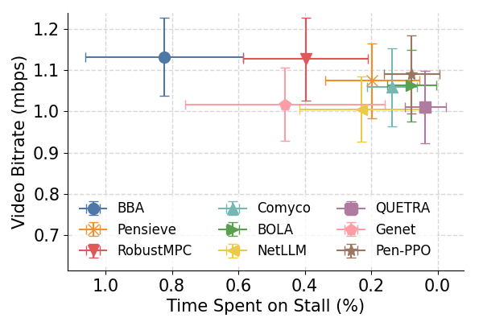

   Mean video bitrate across the full trace set.

Across all transports, bitrate means are close: BBA and RobustMPC are highest at about 1.13 Mbps, followed by Pen-PPO, Pensieve, BOLA, and NetLLM. This already hints that bitrate alone is a weak discriminator.

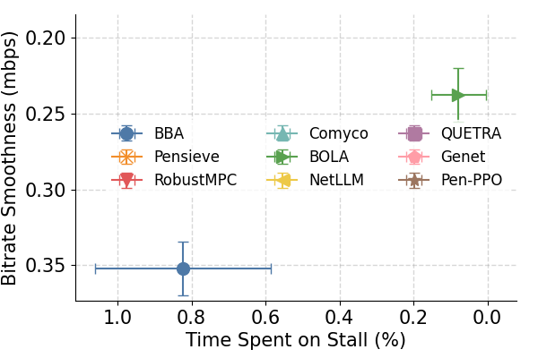

   Bitrate smoothness across the full trace set.

Smoothness separates the schemes more clearly. NetLLM and Pen-PPO are the smoothest overall, while BBA and BOLA make larger switches.

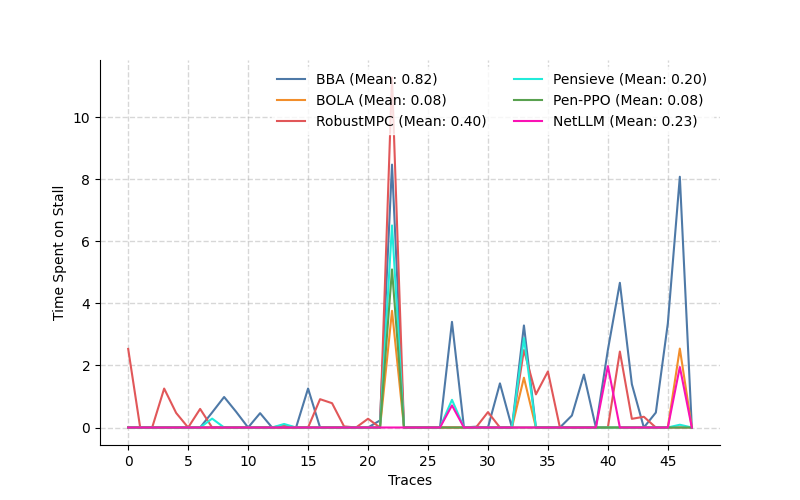

   Time spent on stall across the full trace set.

The stall plot explains why BBA's bitrate lead does not translate into the best experience. BBA has the highest stall burden, while Pen-PPO and BOLA are much safer.

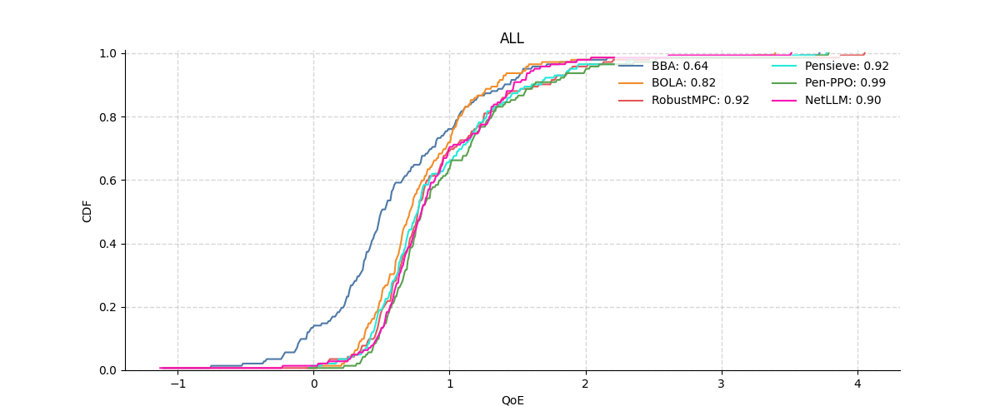

   QoE CDF across the full trace set.

The aggregate QoE CDF ranks Pen-PPO first, with RobustMPC and Pensieve next. BBA is clearly left-shifted despite its high bitrate.

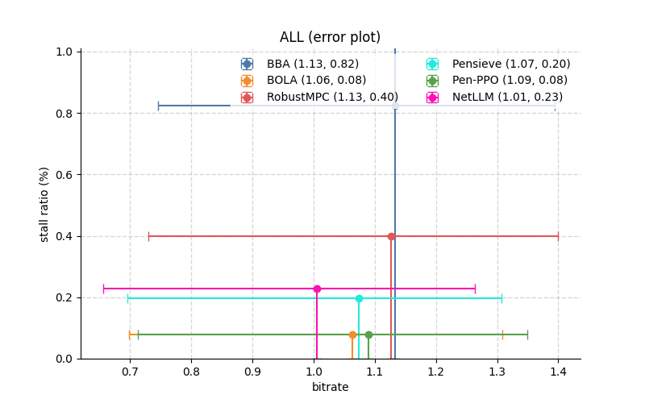

   Bitrate versus stall tradeoff across the full trace set.

This tradeoff plot makes the main lesson explicit: **bitrate is not enough**. BBA and RobustMPC sit near the same bitrate region as Pen-PPO and Pensieve, but with substantially higher stall. Pen-PPO is attractive because it stays close to the right side while remaining near the bottom.

.. _transport-specific-evaluation:

Transport-specific Evaluation
-----------------------------

Each subsection includes route context, bandwidth structure, and the scheme comparison plots produced by ``plot_grouped.py``.

.. _bus:

Bus
~~~

The bus route runs from **Ljabru to Jernbanetorget** in Oslo. It mixes dense city movement with changing coverage and is a useful urban mobility benchmark.

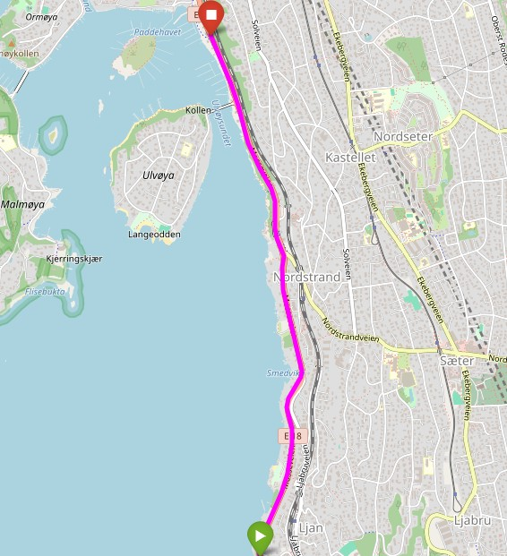

   Bus route map.

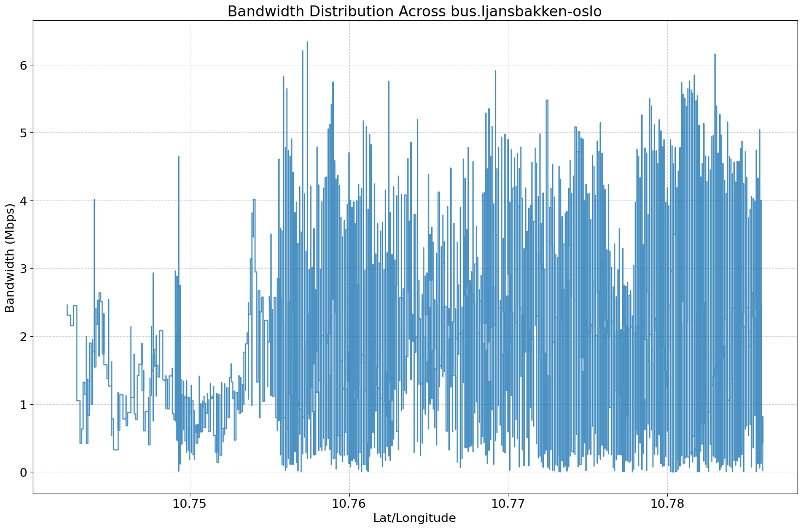

   Observed bandwidth along the bus route.

The updated bus bandwidth view shows a route that starts in a lower and more irregular throughput region, then transitions into a long, bursty high-capacity stretch with many samples between roughly 2--5 Mbps and repeated spikes above 6 Mbps. Rather than one catastrophic outage, bus exhibits sustained volatility with a clear mid-route improvement, so it is a good test of whether a controller can climb quickly when capacity improves without becoming unstable.

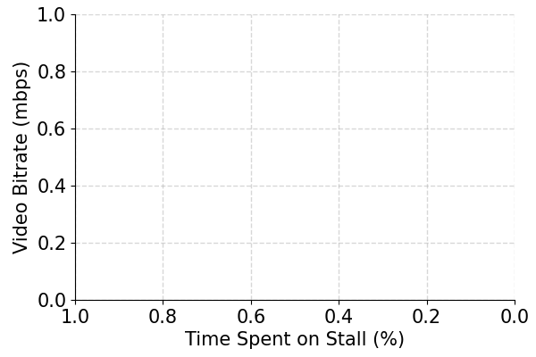

   Mean video bitrate for bus traces.

RobustMPC has the highest average bitrate on bus, with Pen-PPO, Pensieve, and NetLLM close behind.

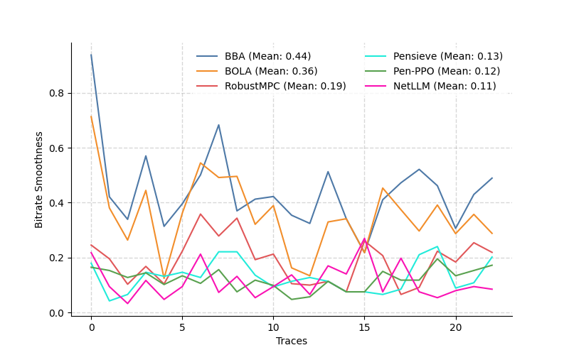

   Bitrate smoothness for bus traces.

Smoothness favors NetLLM, Pen-PPO, and Pensieve. BBA is the least stable.

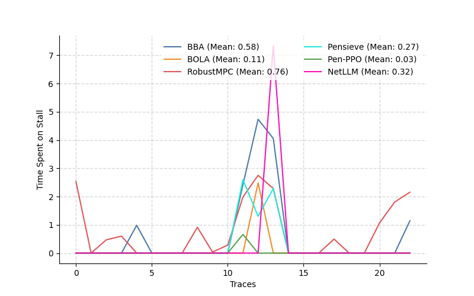

   Time spent on stall for bus traces.

Pen-PPO has the lowest stall on bus, while BBA and RobustMPC show larger spikes.

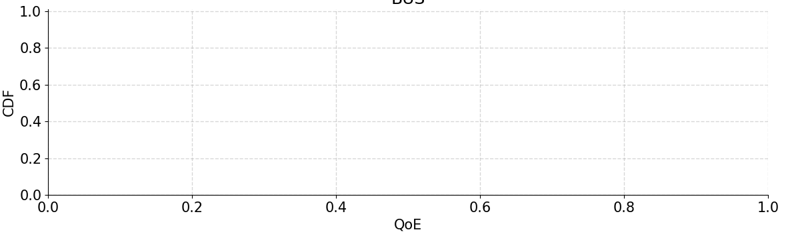

   QoE CDF for bus traces.

Pen-PPO is best on bus, with Pensieve and RobustMPC close behind.

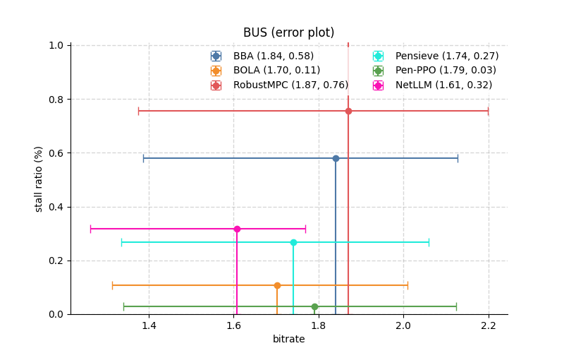

   Bitrate versus stall tradeoff for bus traces.

The bus tradeoff view shows why raw bitrate is misleading. RobustMPC reaches the highest mean bitrate, but Pen-PPO sits much lower on stall and therefore offers the stronger overall operating point.

.. _car:

Car
~~~

The car dataset includes **Alesund to Oslo** and **Oslo to Alesund**. These are long routes with both strong and very weak connectivity regions, so they stress long-horizon adaptation.

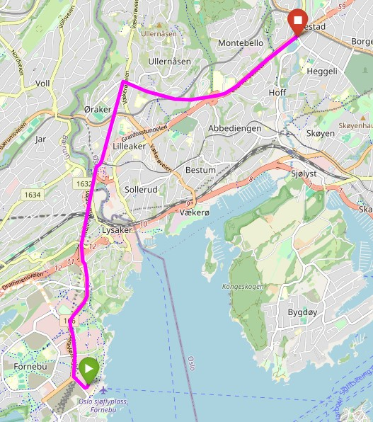

   Car route map.

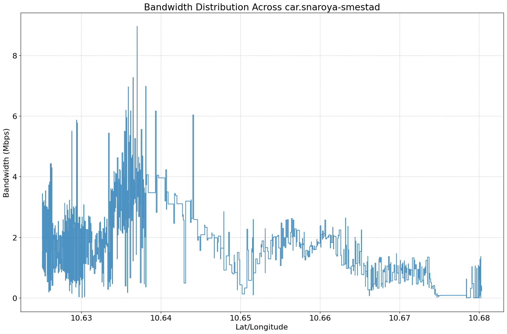

   Observed bandwidth along the car route.

The updated car bandwidth trace for ``car.snaroya-smestad`` begins with mixed moderate bandwidth, rises into a highly bursty section with several sharp peaks approaching the top of the figure, and then gradually decays into a long lower-throughput tail with near-zero samples near the end. This makes car a strong long-horizon adaptation test: algorithms that chase the early spikes too aggressively can be exposed once the route settles into weaker connectivity.

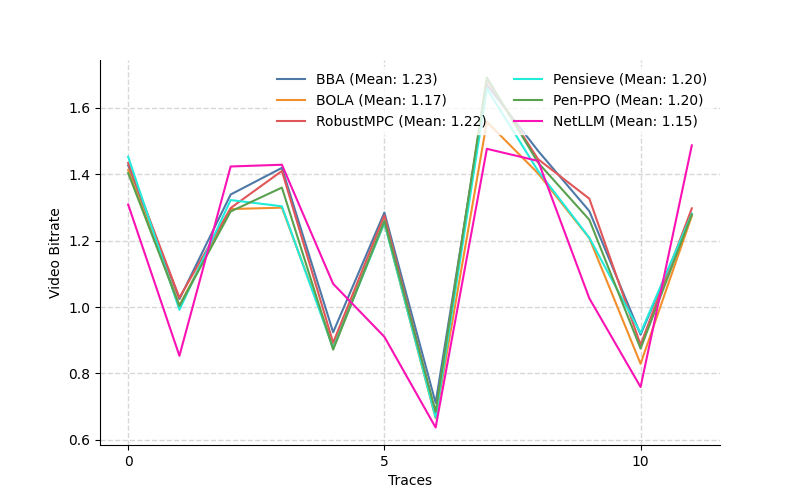

   Mean video bitrate for car traces.

BBA and RobustMPC are highest in bitrate, with Pen-PPO and Pensieve close behind.

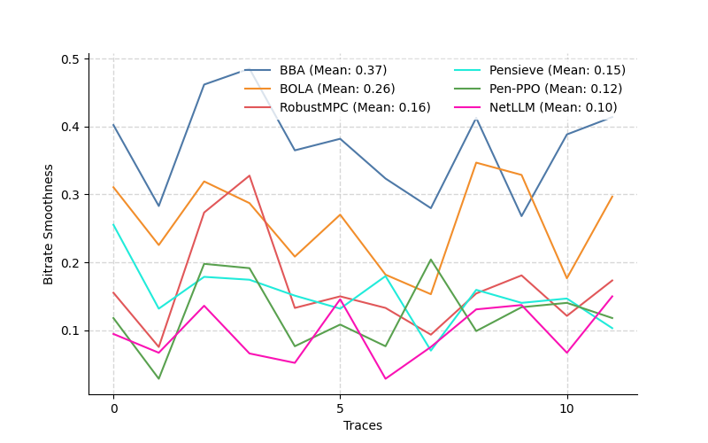

   Bitrate smoothness for car traces.

NetLLM and Pen-PPO are much smoother than BBA and BOLA.

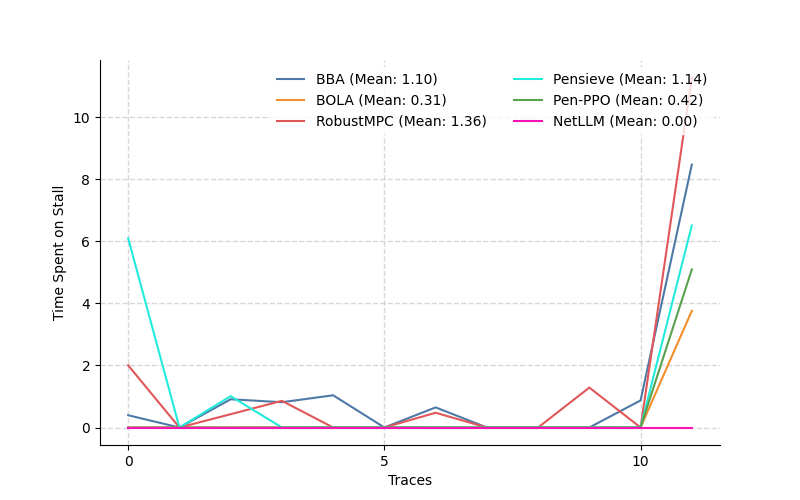

   Time spent on stall for car traces.

The stall plot is decisive: NetLLM has zero mean stall, Pen-PPO is low, while BBA and RobustMPC suffer large failures.

   QoE CDF for car traces.

Car is one of NetLLM's strongest groups, with Pen-PPO next.

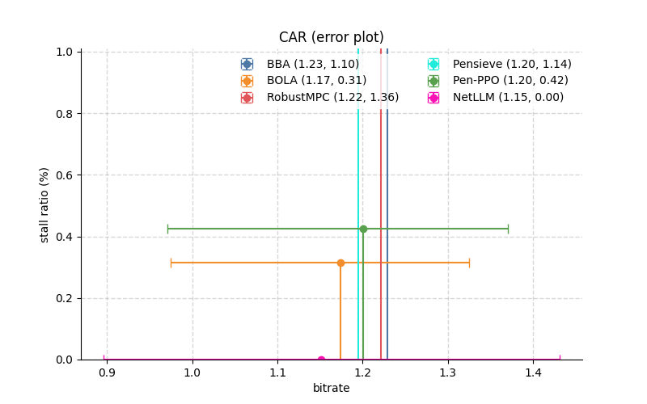

   Bitrate versus stall tradeoff for car traces.

The car tradeoff plot is a strong counterexample to bitrate-only analysis. BBA, RobustMPC, Pensieve, and Pen-PPO all cluster around similar bitrate, but NetLLM and Pen-PPO sit much lower on stall, which is why they look better in QoE.

.. _ferry:

Ferry
~~~~~

The ferry route runs from **Nesoddtangen to Aker brygge**. Compared with land-only routes, it exposes the player to waterfront coverage changes and a different infrastructure geometry.

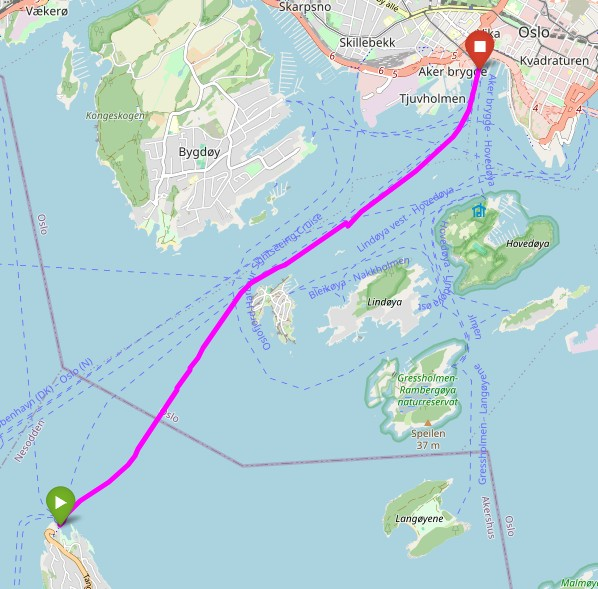

   Ferry route map.

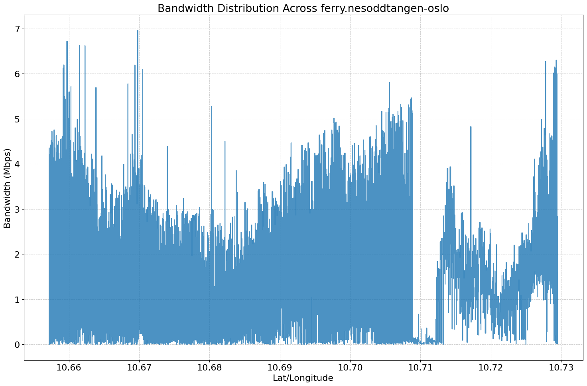

   Observed bandwidth along the ferry route.

The updated ferry profile for ``ferry.nesoddtangen-oslo`` is structured in phases: an initially strong section with many samples around 3--5 Mbps and spikes beyond 6 Mbps, a broad middle trough, a renewed high-capacity segment, and then a sharp disruption where the bandwidth briefly drops close to zero before recovering again. This stop--recover pattern is important because it rewards controllers that can both exploit the strong open-water stretches and quickly back off around abrupt weak-signal intervals.

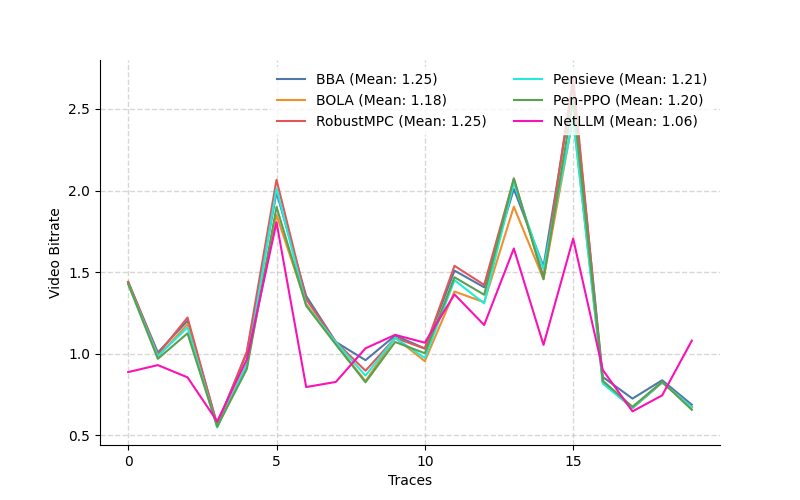

   Mean video bitrate for ferry traces.

BBA and RobustMPC achieve the highest mean bitrate on ferry, with Pensieve and Pen-PPO close behind.

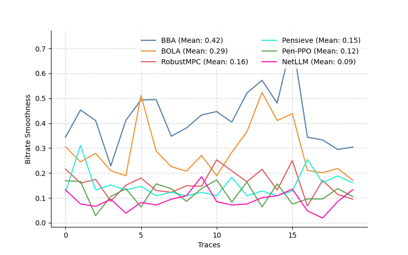

   Bitrate smoothness for ferry traces.

Smoothness favors NetLLM and Pen-PPO.

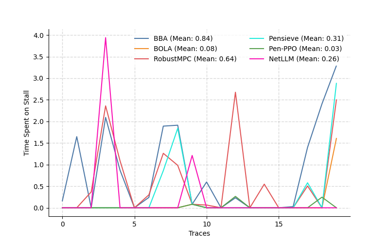

   Time spent on stall for ferry traces.

Pen-PPO is the safest ferry controller, while BBA and RobustMPC incur larger failures.

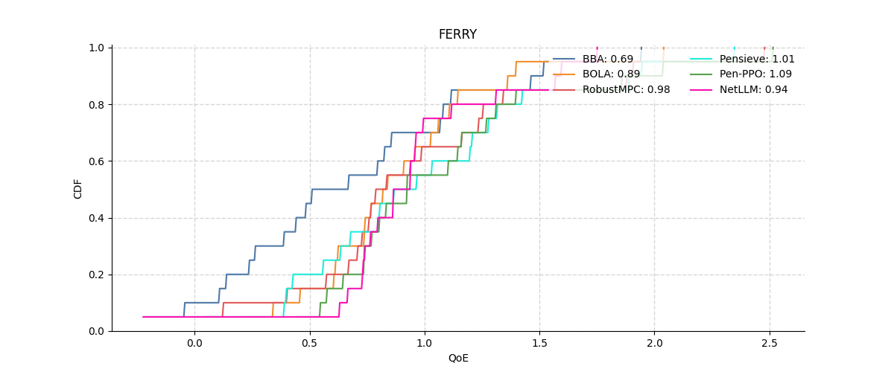

   QoE CDF for ferry traces.

Ferry is one of Pen-PPO's strongest groups.

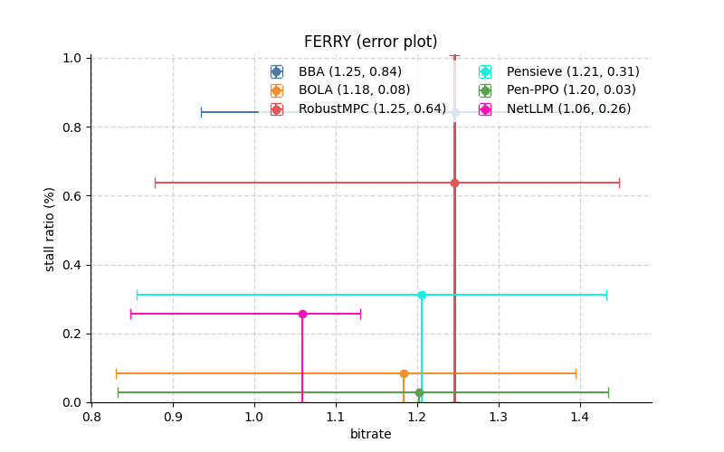

   Bitrate versus stall tradeoff for ferry traces.

The ferry tradeoff plot again shows why bitrate is insufficient. BBA and RobustMPC sit to the right, but they also sit much higher on stall. Pen-PPO is closer to the bottom with only a small bitrate sacrifice.

.. _metro:

Metro
~~~~~

The metro route runs from **Kalbakken to Jernbanetorget**. Part of the route is underground in a tunnel with very weak signal, making metro one of the hardest mobility stress tests in the set.

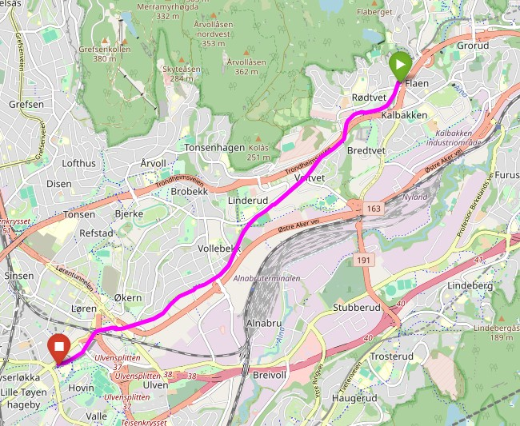

   Metro route map.

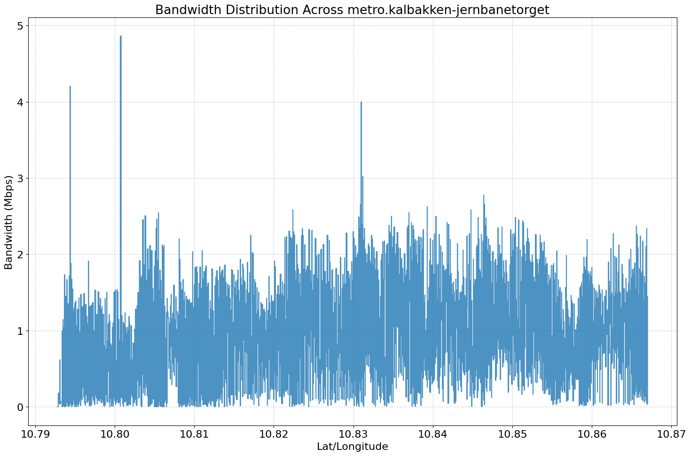

   Observed bandwidth along the metro route.

The updated metro trace for ``metro.kalbakken-jernbanetorget`` is less about one complete collapse and more about persistent moderate bandwidth with noisy local variation: much of the route stays around roughly 0.5--2.2 Mbps, with occasional spikes toward 4--5 Mbps. That makes metro a good benchmark for conservative adaptation under sustained uncertainty, where frequent medium-scale changes matter more than a single dramatic outage.

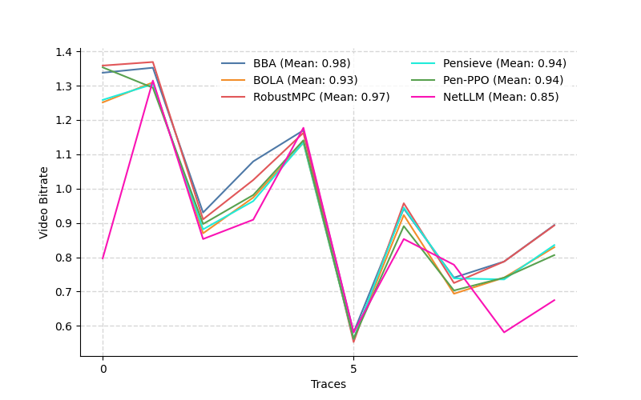

   Mean video bitrate for metro traces.

BBA and RobustMPC lead in bitrate, but the gap over Pen-PPO and Pensieve is small.

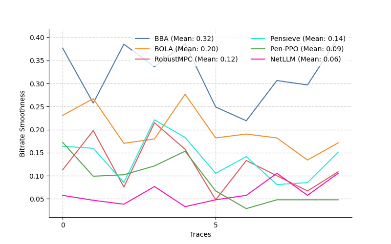

   Bitrate smoothness for metro traces.

NetLLM and Pen-PPO are the smoothest metro controllers.

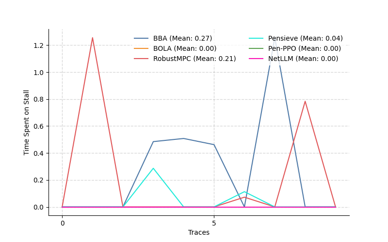

   Time spent on stall for metro traces.

Pen-PPO, NetLLM, and BOLA achieve zero mean stall on metro, while BBA and RobustMPC incur the main failures.

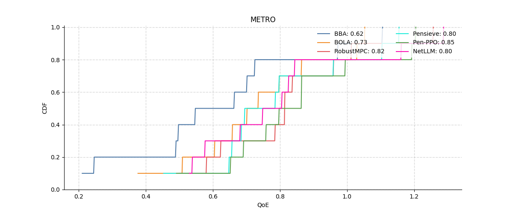

   QoE CDF for metro traces.

Metro is another strong result for Pen-PPO.

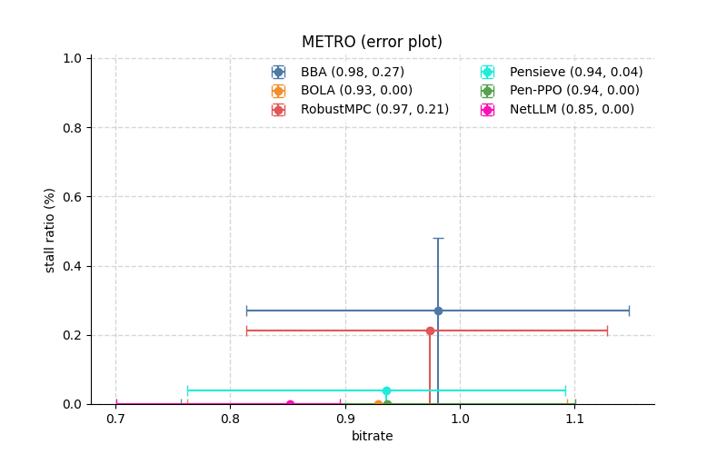

   Bitrate versus stall tradeoff for metro traces.

Metro makes the bitrate problem obvious. BBA has the highest bitrate and still loses badly because its point sits far above the low-stall cluster. In tunnel-heavy mobility, a slightly lower bitrate with near-zero stall is clearly preferable.

.. _train:

Train
~~~~~

The train dataset includes **Oslo to Vestby** and **Vestby to Oslo**. These traces capture longer rail mobility with repeated coverage changes over a corridor rather than a short city segment.

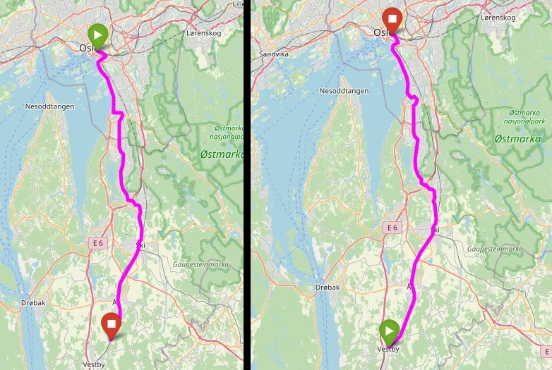

   Train route map.

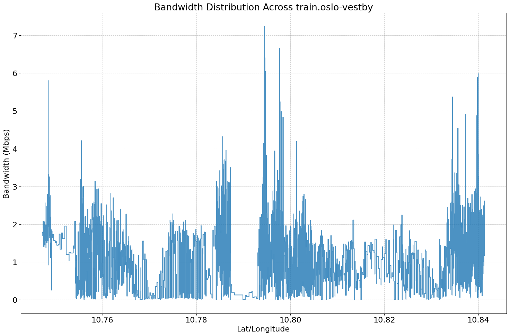

   Observed bandwidth along the train route.

The updated train bandwidth figures show strong directional variability across both ``train.oslo-vestby`` and ``train.vestby-oslo``. In both directions the route alternates between low-throughput pockets, bursty mid-range regions, and occasional large spikes above 5 Mbps, but the exact placement and severity of those pockets differ between directions. This makes train useful for evaluating whether an ABR method generalizes across the same corridor when the temporal structure of capacity changes is not symmetric.

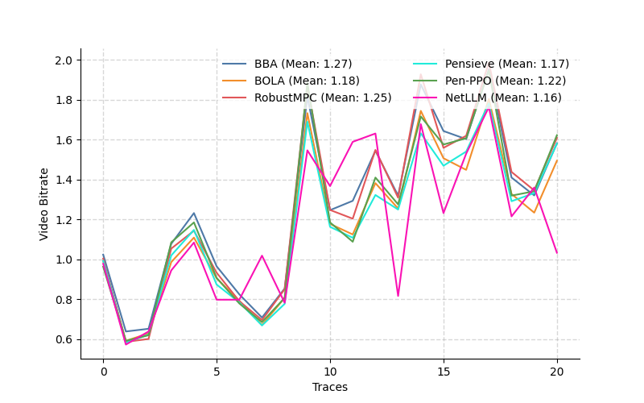

   Mean video bitrate for train traces.

Train bitrate is led by BBA and RobustMPC, with Pen-PPO and Pensieve only slightly lower.

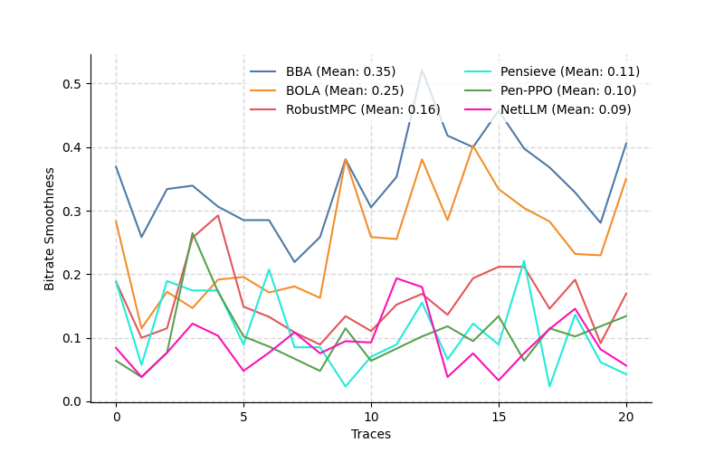

   Bitrate smoothness for train traces.

NetLLM and Pen-PPO are the smoothest, while BBA and BOLA switch more.

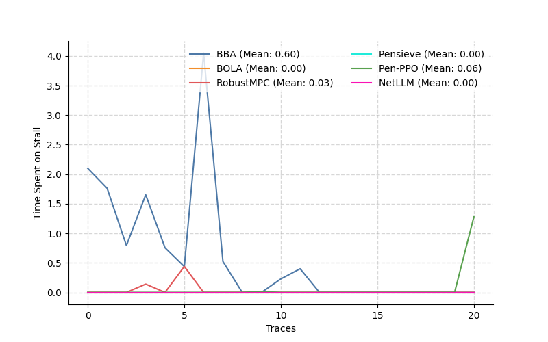

   Time spent on stall for train traces.

Train stall is where BBA collapses. Despite its bitrate lead, it has by far the largest rebuffer burden.

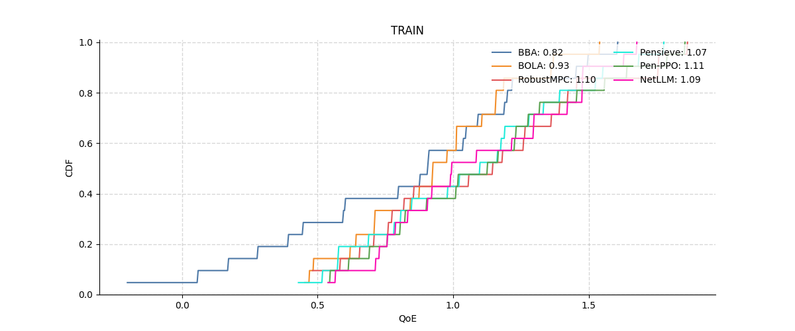

   QoE CDF for train traces.

Pen-PPO is best on train, with RobustMPC and NetLLM close behind.

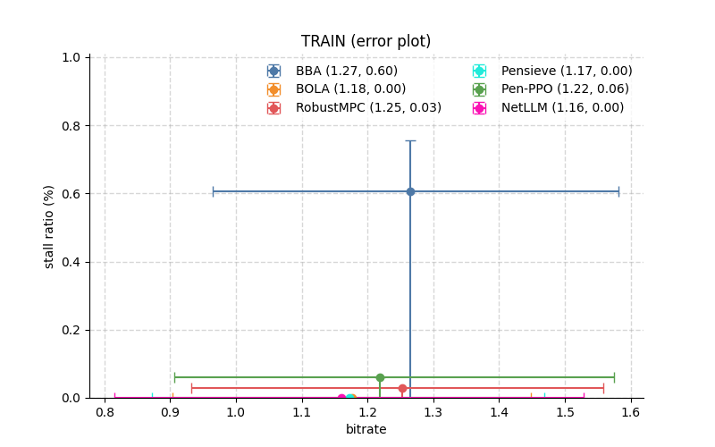

   Bitrate versus stall tradeoff for train traces.

The train tradeoff plot makes it clear that BBA's extra bitrate is too expensive. The better operating region is occupied by Pen-PPO, NetLLM, and RobustMPC, which remain much lower on stall.

.. _tram:

Tram
~~~~

The tram portion includes multiple urban routes such as **Ljabru to Jernbanetorget**, **Jernbanetorget to Ljabru**, and **Jernbanetorget to University hospital**. These stop-and-go traces test whether a controller can avoid overreacting to recurring medium-scale changes.

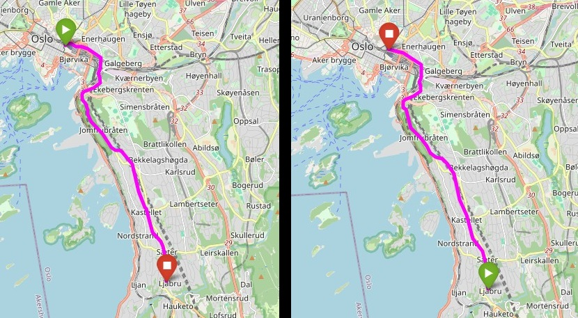

   Tram route map.

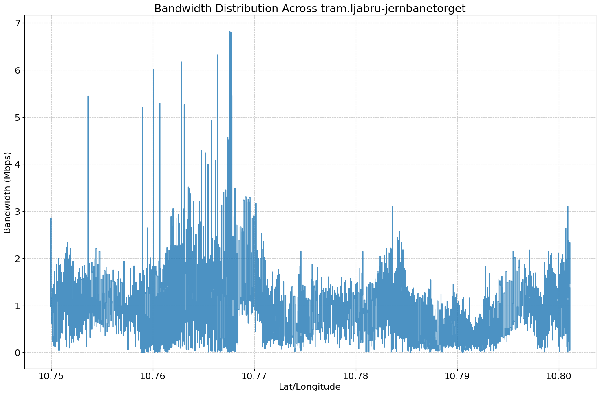

   Observed bandwidth along the tram route.

The updated tram views show clear directional asymmetry. ``tram.ljabru-jernbanetorget`` contains a noisier and more bursty middle section with several tall spikes, while ``tram.jernbanetorget-ljabru`` is more compressed and generally stays within a lower range. Across both directions, most of the route lives in a moderate-bandwidth regime with frequent short swings rather than long hard outages, so tram remains a strong stability-focused benchmark where overshooting on short-lived peaks can still hurt consistency.

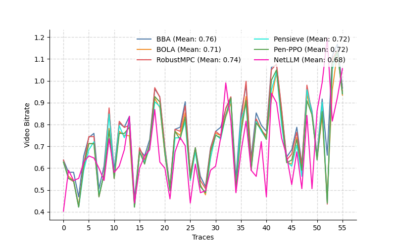

   Mean video bitrate for tram traces.

On tram, the bitrate differences are fairly small. BBA and RobustMPC are slightly higher, while NetLLM is most conservative.

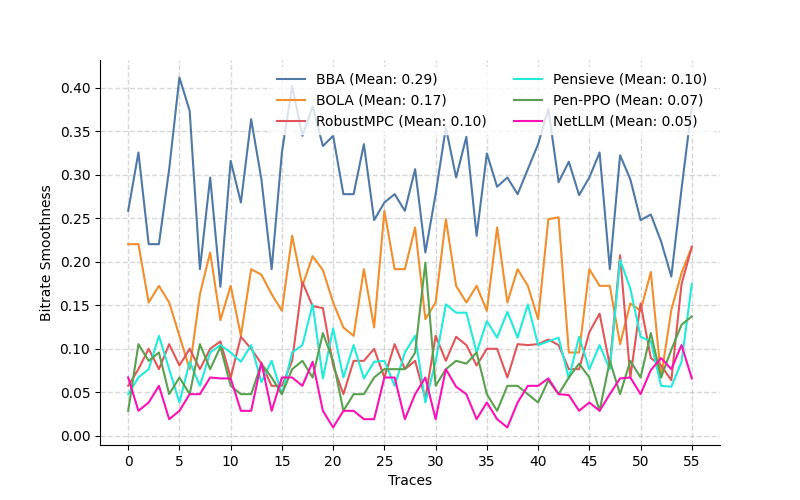

   Bitrate smoothness for tram traces.

Tram smoothness strongly favors NetLLM and Pen-PPO.

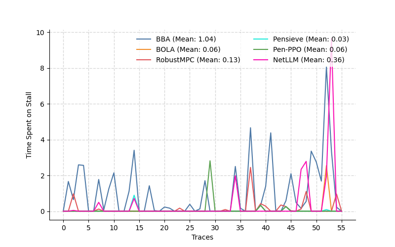

   Time spent on stall for tram traces.

BBA has several large stall spikes, while Pensieve and Pen-PPO are nearly stall-free.

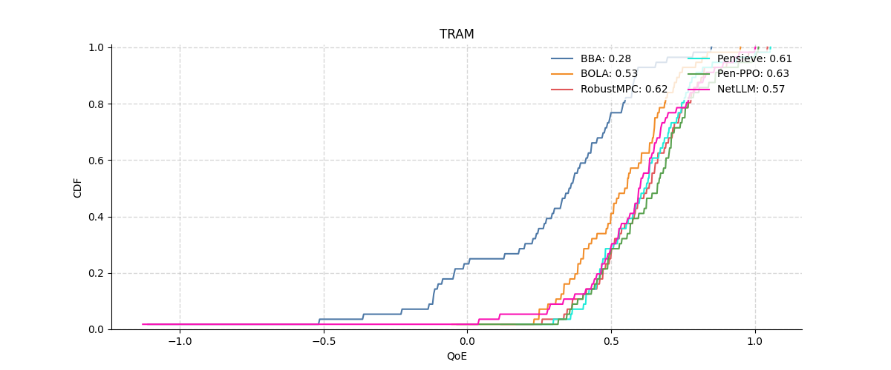

   QoE CDF for tram traces.

Pen-PPO is best on tram, with RobustMPC and Pensieve close behind.

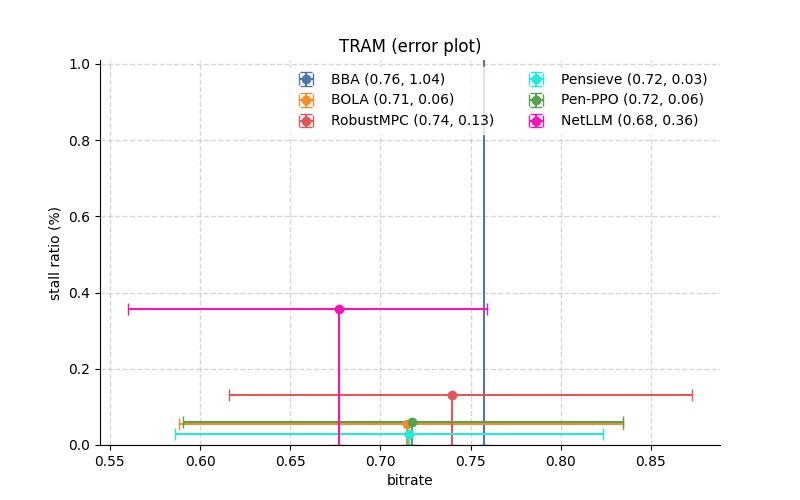

   Bitrate versus stall tradeoff for tram traces.

The tram tradeoff plot again shows why bitrate is not enough: BBA sits rightward, but far too high on stall. Pen-PPO and Pensieve give up very little bitrate while staying much safer.

Implementation Notes from ``plot_grouped.py``
---------------------------------------------

Several implementation details directly affect how these figures should be interpreted:

- ``collect_scheme_metrics()`` searches the trace root recursively for ``*.txt`` files and filters transport-specific runs by matching ``_{transport}_`` in the filename stem. It also sorts files by the trailing numeric token in the filename so trace ordering is stable across schemes. 
- The per-scheme accumulator is initialized as ``{'reward': [], 'bitrate': [], 'stall': [], 'smoothness': []}``, so every plot is ultimately driven by per-trace summary values rather than raw per-chunk sequences.
- ``parse_log_file()`` reads four key pieces of information from each line: timestamp, bitrate, rebuffer duration, and reward. Bitrate is converted from kbps to Mbps immediately with ``float(sp[1]) / 1000.0``.
- Malformed rows are skipped with ``try/except``, which makes the parser tolerant to noisy logs but also means partial files can silently contribute fewer samples.
- ``summarize_metrics()`` drops logs with empty bitrate lists or reward lists of length ``<= 1``. This avoids invalid averages and also means missing or truncated logs are excluded from the aggregate.
- ``mean_reward`` is computed as ``np.mean(reward[1:])`` rather than over the full sequence, so the first reward entry is intentionally omitted.
- ``mean_bitrate`` is the arithmetic mean over the parsed bitrate sequence.
- ``stall_pct`` is normalized as ``sum(rebuffer[1:]) / (VIDEO_LEN * 4.0 + sum(rebuffer[1:])) * 100``. This is important: the stall plot is **not raw stall seconds**, but a normalized stall ratio derived from total playback time plus rebuffer time.
- ``smoothness`` is computed as ``mean(abs(diff(bitrate)))``. It measures average switching magnitude, not switch count.
- ``group_plots()`` writes figures using the naming pattern ``baselines-{suffix}-*.png``, where ``suffix`` is either a transport name or ``all``. That output convention is what drives the figure references used in this documentation.
- The aggregate ``all`` plots use ``skip = 3`` while transport-specific plots use ``skip = 1``. This means the full benchmark line plots are intentionally downsampled for readability, while transport-specific views preserve every available trace point.
- ``plot()`` labels each line with the scheme name plus the mean of the plotted metric, which is why the legends expose direct per-panel metric averages.
- ``plot_qoe_cdf()`` builds QoE curves from a 500-bin histogram and cumulative sum. These are empirical distribution summaries over per-trace reward values, not parametric fits.
- ``fix_axes()`` centralizes styling across figures: axis labels, dashed grid, hidden top/right spines, a three-column legend in the upper right, and optional titles. This is why the panels have a consistent visual style throughout the page.

References
----------

.. [MMSys2013] Haakon Riiser, Paul Vigmostad, Carsten Griwodz, and Pal Halvorsen. *Commute Path Bandwidth Traces from 3G Networks: Analysis and Applications*. Proceedings of MMSys 2013.

.. [DatasetPage] Norway mobile bandwidth trace dataset page: ``https://skulddata.cs.umass.edu/traces/mmsys/2013/pathbandwidth/``
